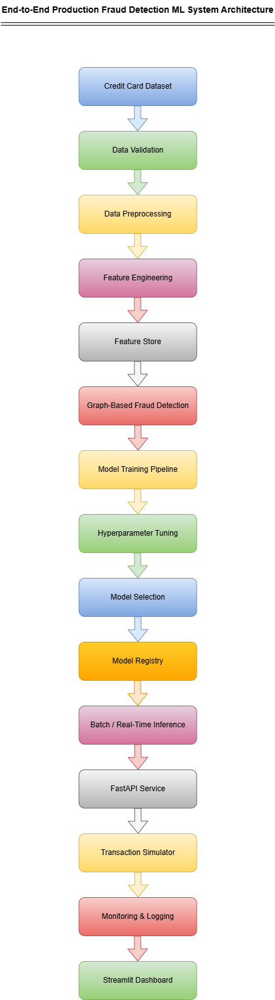
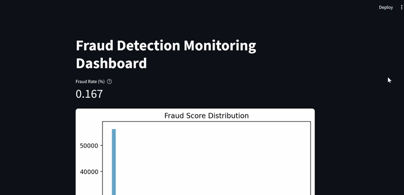
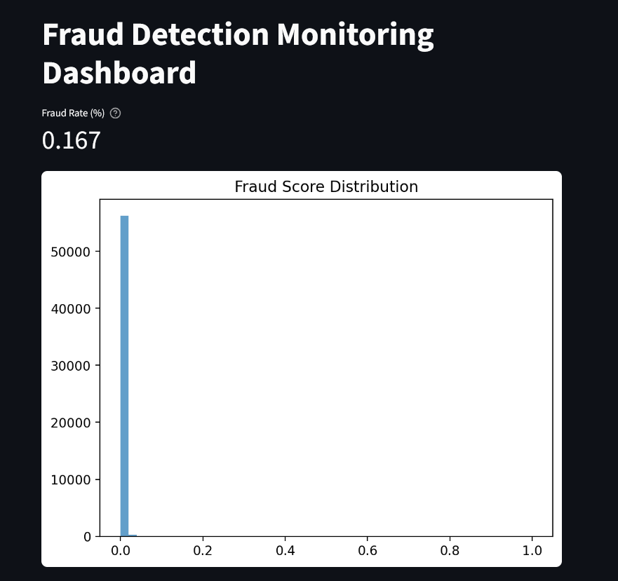
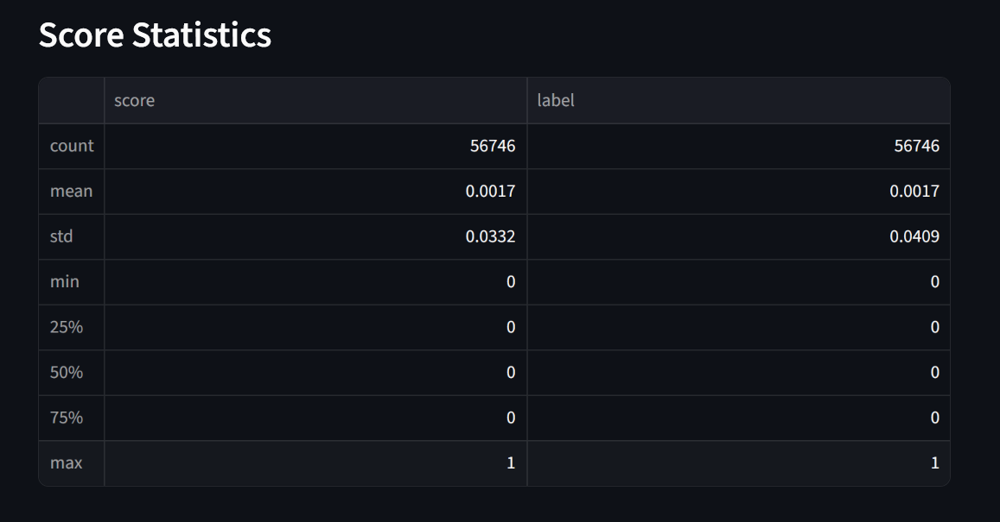
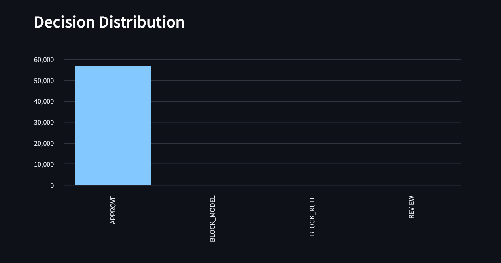
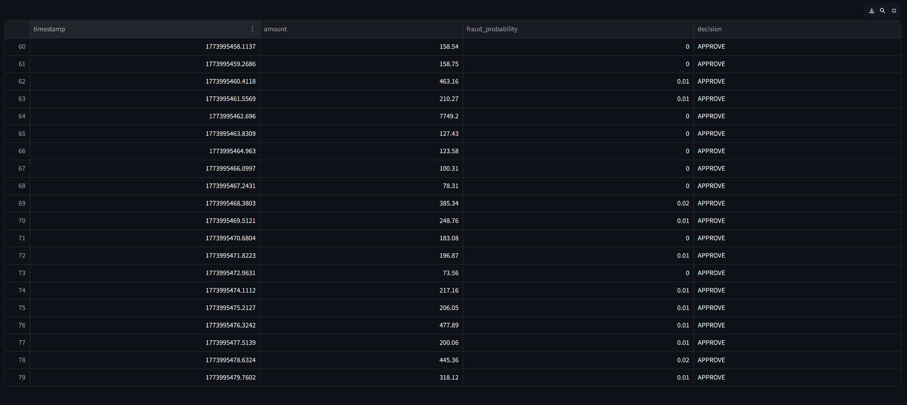
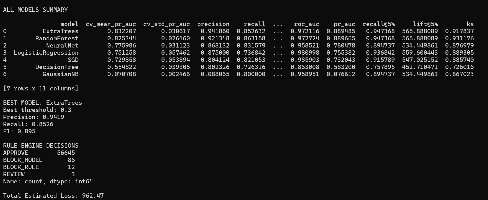
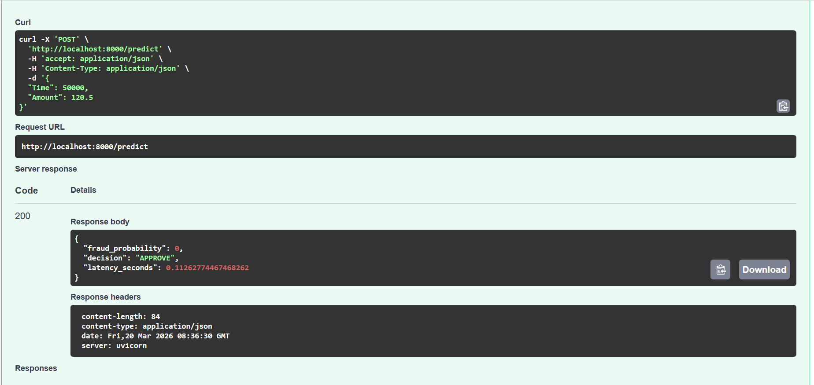

# 💳 Credit Card Fraud Detection ML System


Production-grade end-to-end machine learning system for detecting fraudulent credit card transactions.

---

## 🚀 Project Overview

This project builds a complete fraud detection system with:

* Automated ML pipeline
* Feature engineering & feature store
* Graph-based fraud detection
* Multiple ML models
* Real-time API
* Transaction simulator
* Monitoring dashboard
* Feature drift detection

---

## 🏗 System Architecture



---

## 📊 Monitoring Dashboard

The system includes a real-time monitoring dashboard built using **Streamlit** to track fraud predictions and system behavior.

---

### 🎬 Dashboard Demo (Live Flow)



---

### 📈 Fraud Score Distribution

This plot shows how predicted fraud probabilities are distributed across transactions.



---

### 📊 Score Statistics

Statistical summary of fraud scores and labels to monitor distribution shifts.



---

### 🚦 Decision Distribution

Shows how many transactions are approved, blocked, or sent for review.



---

### 📋 Recent Transactions

Displays recent predictions with amount, fraud probability, and decision.



---

### 🔍 What This Dashboard Helps With

 - Detect abnormal fraud score patterns
 - Monitor model prediction behavior
 - Track approval vs rejection rates
 - Identify potential model drift
 - Debug real-time predictions

---

## 📈 Model Results



**Best Model:** Extra Trees Classifier

---

## ⚡ Real-Time Prediction API



### Run API

```bash
python scripts/run_api.py
```

### Endpoint

```
POST /predict
```

### Example Request

```json
{
  "Time": 50000,
  "Amount": 120.5
}
```

### Example Response

```json
{
  "fraud_probability": 0.02,
  "decision": "APPROVE"
}
```

---

## 🔁 Transaction Simulator

```bash
python scripts/run_simulation.py
```

---

## 📊 Data Visualization (EDA)

* notebooks/fraud_data_visualization.ipynb
* notebooks/fraud_data_visualization.html

Note: The sample dataset provided is a subset of the original raw dataset. 
All preprocessing and feature engineering are handled in the pipeline.

---

## ⚙ Machine Learning Pipeline

* Data validation
* Data preprocessing
* Feature engineering
* Feature store
* Graph-based features
* Model training
* Hyperparameter tuning
* Model selection
* Model registry

---

## 🤖 Models Used

* Logistic Regression
* Random Forest
* Extra Trees
* Gradient Boosting
* XGBoost
* LightGBM
* Neural Network

---

## 📈 Evaluation Metrics

* Precision
* Recall
* F1 Score
* ROC-AUC
* PR-AUC
* Recall@K
* Lift@K
* KS Statistic

---

## 📂 Project Structure

```
fraud-detection-ml-system
│
├── src
├── serving
├── scripts
├── monitoring
├── feature_store
├── graph_detection
│
├── notebooks
├── data
├── docs
│
├── requirements.txt
├── README.md
└── .gitignore
```

---

## 🛠 Tech Stack

Python, Scikit-Learn, XGBoost, LightGBM, FastAPI, Streamlit, Pandas, NumPy

---

## ▶️ How to Run

### 1. Train Model

```bash
python scripts/train_model.py
```

### 2. Start API

```bash
python scripts/run_api.py
```

### 3. Run Simulator

```bash
python scripts/run_simulation.py
```

### 4. Start Dashboard

```bash
streamlit run monitoring/monitoring_dashboard.py
```

---

## 📌 Future Improvements

* Kafka streaming
* Online learning
* SHAP explainability
* Cloud deployment

---

## 👤 Author

**Narendra Kalam**  
Machine Learning & Data Science  

📧 kalamnarendra2001@gmail.com  

🔗 https://www.linkedin.com/in/narendra-kalam-290543278

🌐 Portfolio: (your website)
