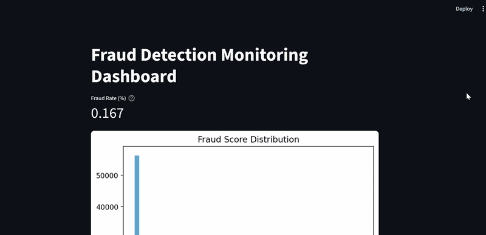
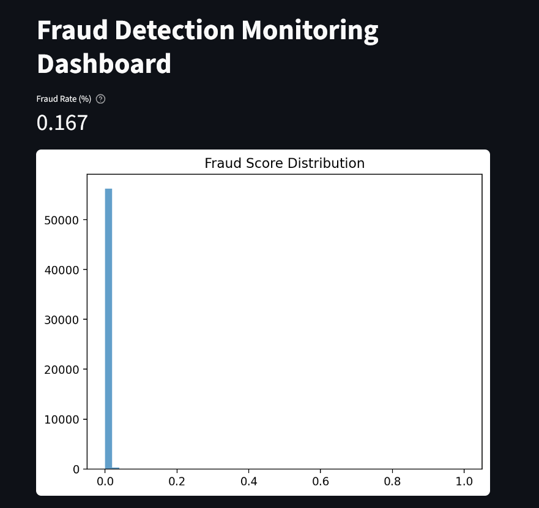
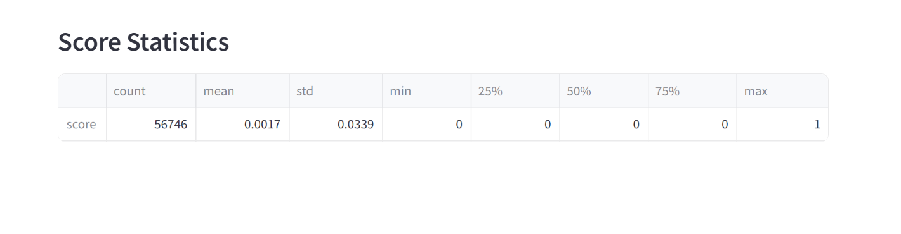
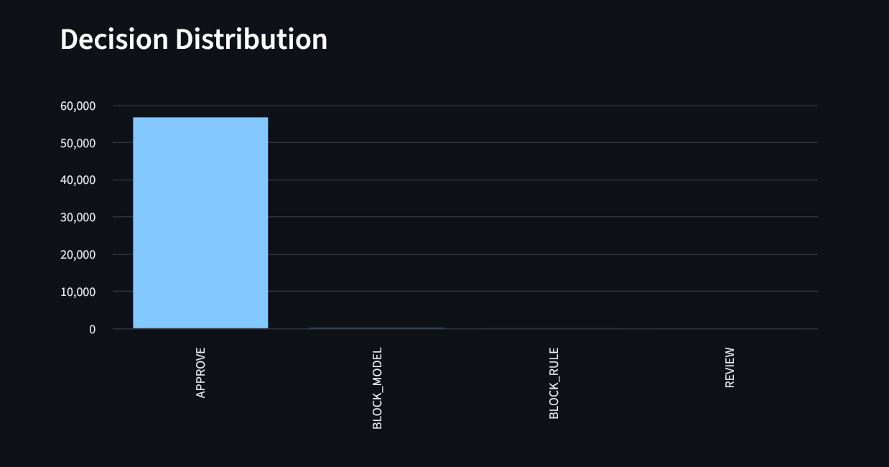
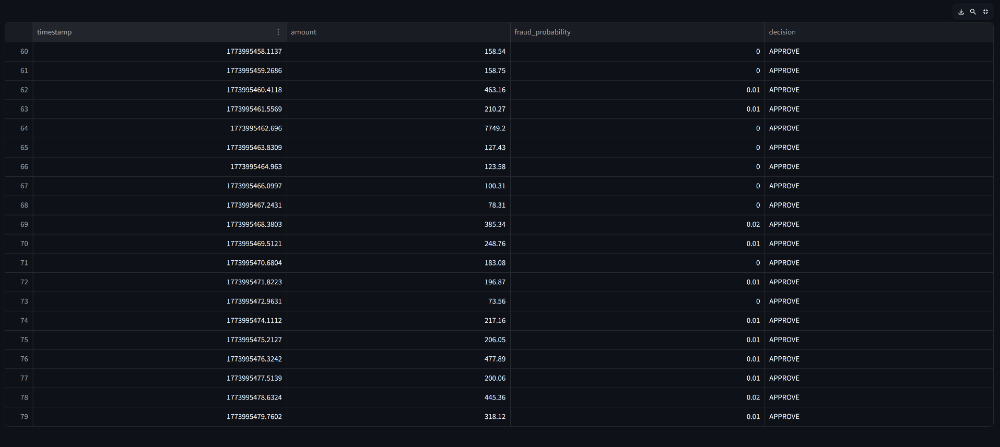
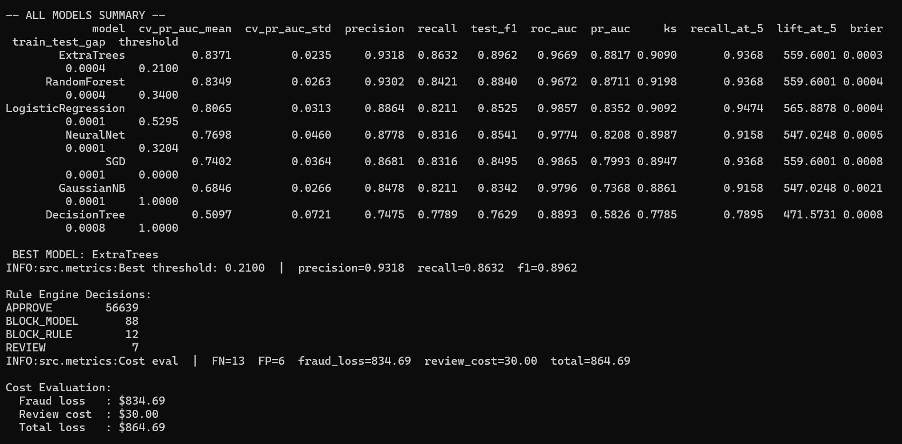
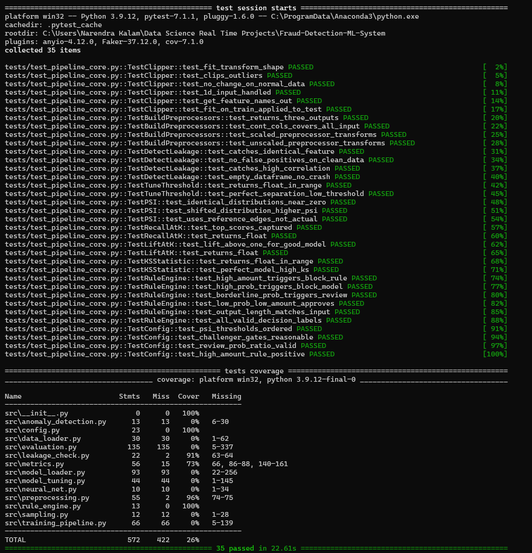
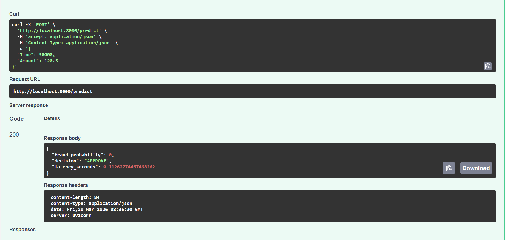

# 💳 Credit Card Fraud Detection ML System

⭐ **If you find this project useful, please give it a star!**


Production-grade end-to-end machine learning system for **real-time credit card fraud detection** with a
**3-tier decision engine (APPROVE / REVIEW / BLOCK)**, IQR-based outlier clipping, correct PSI drift monitoring,
Champion vs Challenger promotion system, model card, and a 5-section live monitoring dashboard.

---

## 🚀 Project Overview

This project builds a complete **Fintech-grade Fraud Detection System** with:

* Automated ML training pipeline — 11 models, hyperparameter tuning
* Rich feature engineering — temporal (sin/cos), feature store, graph-based, anomaly score
* IQR-based `Clipper` transformer — prevents outlier distortion of StandardScaler
* SMOTE + `fast_training_sample` — handles 578:1 class imbalance
* Dual ColumnTransformer — scaled preprocessor for linear models, unscaled for tree models
* Leakage detection — exact match + near-perfect correlation check before training
* 3-tier rule engine — BLOCK_RULE / BLOCK_MODEL / REVIEW / APPROVE
* Champion vs Challenger model promotion system (3 promotion gates)
* Correct edge-based PSI drift monitoring (fixed from rank-based approach)
* Model card — structured JSON with metrics, cost eval, feature importances
* MLflow experiment tracking
* 35 pytest unit tests with coverage report
* Real-time FastAPI + Transaction Simulator
* Streamlit monitoring dashboard — 5 sections with real-time alerts

---

## 💡 Why This Project Matters

Real fraud detection requires more than a trained classifier.
This system combines ML + business rules + monitoring + governance to simulate
real-world payment system decision pipelines.

---

## 🏗 System Architecture


---
## 🌐 Live Demo

📊 Real-time fraud monitoring with interactive visualizations

🚀 **Fraud Monitoring Dashboard (Live)**
👉 [https://YOUR-STREAMLIT-LINK](https://fraud-detection-ml-system-wmawvpwwe65vdwm7gsth3p.streamlit.app/)

⚡ **Fraud Detection API**
👉 [https://YOUR-RENDER-LINK](https://fraud-detection-ml-system.onrender.com)

📄 **API Docs:**
👉 [https://YOUR-RENDER-LINK](https://fraud-detection-ml-system.onrender.com/docs)

---

## 📊 Monitoring Dashboard

The system includes a real-time monitoring dashboard built using **Streamlit** to track fraud predictions and system behavior.

---

### 🎬 Dashboard Demo (Live Flow)



---

### 📈 Fraud Score Distribution

This plot shows how predicted fraud probabilities are distributed across transactions.



---

### 📊 Score Statistics

Statistical summary of fraud scores and labels to monitor distribution shifts.



---

### 🚦 Decision Distribution

Shows how many transactions are approved, blocked, or sent for review.



---

### 📋 Recent Transactions

Displays recent predictions with amount, fraud probability, and decision.



---

### 🔍 What This Dashboard Helps With

* Detect abnormal fraud score patterns
* Monitor model prediction behavior in real-time
* Track approval vs block vs review rates
* Identify potential model drift via PSI
* Compare champion vs challenger model versions
* Debug real-time predictions with rule trigger details

---

## 📈 Model Results



**Best Model:** Extra Trees Classifier

| Metric | Value |
|--------|-------|
| F1 Score | 0.8962 |
| ROC-AUC | 0.9669 |
| PR-AUC | 0.8817 |
| KS Statistic | 0.9090 |
| Precision | 0.9318 |
| Recall | 0.8632 |
| Brier Score | 0.0003 |
| Train-Test Gap | 0.0004 |
| Estimated Fraud Loss | $834.69 |

---

## 🆚 Champion vs Challenger System

Every new training run is compared against the production champion using 3 promotion gates:

| Gate | Condition |
|------|-----------|
| F1 Improvement | Challenger must beat champion by ≥ 0.5% |
| ROC-AUC | Challenger must have ROC-AUC ≥ 0.95 |
| Generalization Gap | Train-test gap must be ≤ 10% |

Results logged to `fraud_models/challenger_log.json` and visible in dashboard.

---

## 🎯 Risk Decision Engine

Unlike simple classifiers, this system uses a **3-tier decision engine**:

| Decision | Trigger |
|----------|---------|
| `APPROVE` | Low probability + no rule flags |
| `REVIEW` | Borderline score (prob ≥ threshold × 0.6) |
| `BLOCK_MODEL` | High probability (prob ≥ threshold) |
| `BLOCK_RULE` | Hard rule — Amount > $5,000 |

Rules are checked **before** ML — matching real payment system architecture.

---

## 🧪 Test Coverage



---

## ⚡ Real-Time Prediction API



---

### Run API

```bash
python scripts/run_api.py
```

### Endpoint

```
POST /predict
```

### Example Request

```json
{
  "Time": 50000,
  "Amount": 120.5
}
```

### Example Response

```json
{
  "fraud_probability": 0.0312,
  "decision": "APPROVE",
  "latency_seconds": 0.043
}
```

---

## 🔁 Transaction Simulator

```bash
python scripts/run_simulation.py
```

Supports 3 scenarios: `random`, `risky`, `safe`

---

## 📊 Data Visualization (EDA)

* `notebooks/fraud_detection_eda.ipynb` — 25-step professional EDA
* `notebooks/fraud_detection_eda.html` — rendered HTML version

Note: The sample dataset provided is a subset of the original raw dataset.
All preprocessing and feature engineering are handled in the pipeline.

---

## ⚙ Machine Learning Pipeline

* Data validation + leakage detection
* IQR-based outlier clipping (Clipper transformer)
* Dual preprocessor — scaled (linear models) + unscaled (tree models)
* Feature engineering + feature store + graph features + anomaly score
* SMOTE oversampling + fast screening sample
* 11 models × RandomizedSearchCV (PR-AUC scoring)
* Threshold tuning (max F1)
* Cost-sensitive evaluation (FN loss + FP review cost)
* Model card + MLflow tracking
* Champion vs Challenger comparison

---

## 🤖 Models Used

LR · SGD · GaussianNB · DecisionTree · RandomForest · ExtraTrees ·
GradientBoosting · AdaBoost · XGBoost · LightGBM · CatBoost · MLP (NeuralNet)

---

## 📈 Evaluation Metrics

* Precision / Recall / F1 Score
* ROC-AUC / PR-AUC
* KS Statistic
* Recall@K / Lift@K
* Brier Score
* Train-Test Gap
* Cost Evaluation (Expected Credit Loss)

---

## 🧪 Running Tests

```bash
# Run all tests
pytest tests/ -v

# With coverage report
pytest tests/ -v --cov=src --cov-report=term-missing
```

Tests cover: `Clipper`, `build_preprocessors`, `detect_leakage`,
`tune_threshold`, `psi`, `recall_at_k`, `lift_at_k`, `ks_statistic`,
`rule_engine`, `config` thresholds

---

## 📂 Project Structure

```
fraud-detection-ml-system/
│
├── src/
│   ├── config.py              ← constants, thresholds, PSI limits, challenger gates
│   ├── data_loader.py         ← validation + feature engineering
│   ├── preprocessing.py       ← Clipper + dual ColumnTransformer
│   ├── model_tuning.py        ← 11 model grids + RandomizedSearchCV
│   ├── metrics.py             ← PSI (edge-based fix), KS, cost eval, threshold
│   ├── rule_engine.py         ← 3-tier decision engine
│   ├── evaluation.py          ← model card, feature importances, MLflow, PSI drift
│   ├── leakage_check.py       ← pre-training leakage detection
│   ├── model_loader.py        ← champion load + 3-gate challenger comparison
│   ├── anomaly_detection.py   ← IsolationForest anomaly score
│   ├── neural_net.py          ← MLP pipeline
│   ├── sampling.py            ← fast_training_sample
│   └── training_pipeline.py  ← full orchestration
│
├── serving/
│   └── fraud_api.py          ← FastAPI endpoints
│
├── services/
│   └── prediction_service.py
│
├── monitoring/
│   └── monitoring_dashboard.py  ← 5-section Streamlit dashboard
│
├── simulation/
│   └── transaction_simulator.py
│
├── feature_store/
│   └── fraud_features.py
│
├── graph_detection/
│   └── fraud_graph_detection.py
│
├── scripts/
│   ├── train_model.py
│   ├── run_api.py
│   ├── run_dashboard.py
│   └── run_simulation.py
│
├── tests/
│   └── test_pipeline_core.py ← 35 pytest unit tests
│
├── notebooks/
│   └── fraud_detection_eda.ipynb  ← 25-step professional EDA
│
├── fraud_models/
│   ├── fraud_model_ExtraTrees_v1.joblib
│   ├── latest_model.json
│   ├── model_card_ExtraTrees_v1.json
│   ├── challenger_log.json
│   ├── model_experiment_results.csv
│   ├── monitor_scores.csv
│   └── feature_drift_report.csv
│
├── logs/
│   └── prediction_logs.csv
│
├── docs/
│   └── architecture/
│       └── system_architecture.svg
│
├── .streamlit/
│   └── config.toml
│
├── requirements.txt
├── requirements_api.txt
├── requirements_dashboard.txt
├── runtime.txt
├── render.yaml
├── README.md
└── .gitignore
```

---

## ▶️ How to Run

### 1. Install Dependencies

```bash
pip install -r requirements.txt
```

### 2. Train Model

```bash
# Windows PowerShell
$env:FRAUD_DATA_PATH = "path\to\creditcard.csv"
python scripts/train_model.py

# Mac / Linux
FRAUD_DATA_PATH=path/to/creditcard.csv python scripts/train_model.py
```

### 3. Run Tests

```bash
pytest tests/ -v --cov=src --cov-report=term-missing
```

### 4. Start API

```bash
python scripts/run_api.py
```

### 5. Run Simulator

```bash
python scripts/run_simulation.py
```

### 6. Start Dashboard

```bash
streamlit run monitoring/monitoring_dashboard.py
```

---

## 🛠 Tech Stack

Python · Scikit-Learn · XGBoost · LightGBM · CatBoost · imbalanced-learn ·
FastAPI · Streamlit · NetworkX · MLflow · Pytest · Pandas · NumPy · Seaborn ·
Render · Streamlit Cloud

---

## 📌 Future Improvements

* Kafka streaming for real-time transaction ingestion
* Online learning with concept drift adaptation
* SHAP explainability (version compatibility fix pending)
* A/B traffic splitting for live champion/challenger testing
* Docker + CI/CD pipeline

---

## 👤 Author

**Narendra Kalam**
Machine Learning & Data Science

📧 kalamnarendra2001@gmail.com

🔗 https://www.linkedin.com/in/narendra-kalam

🌐 Portfolio: ...