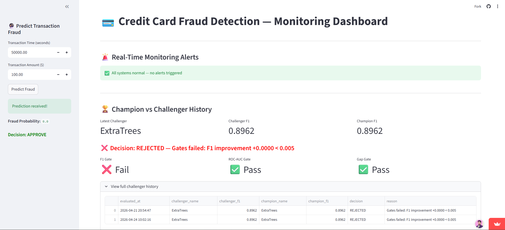
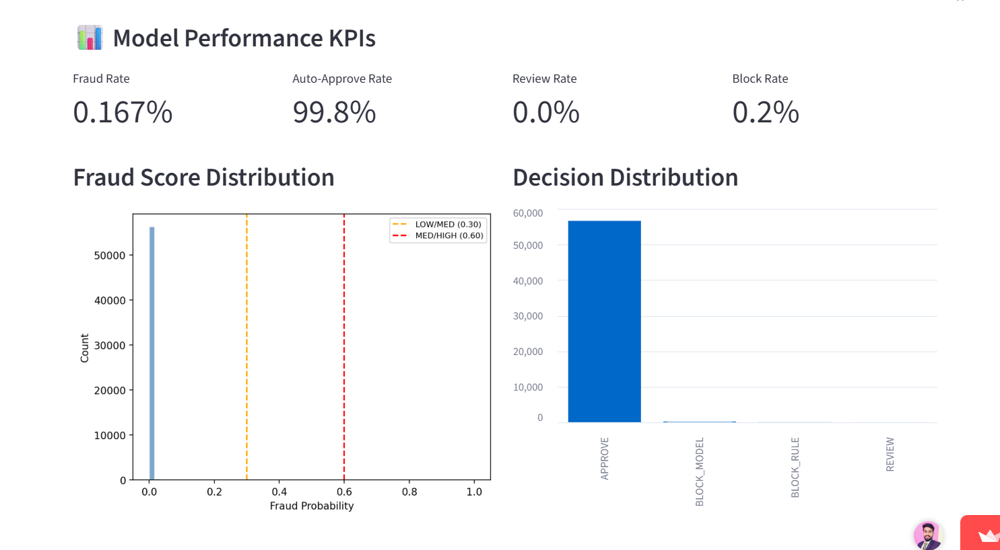
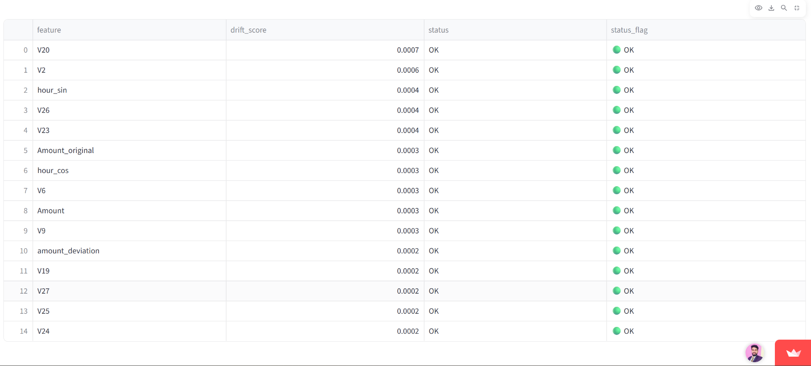
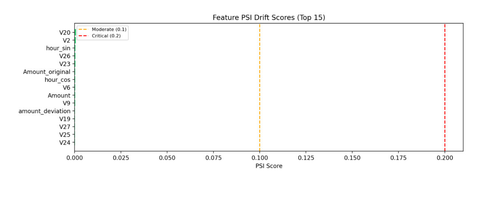
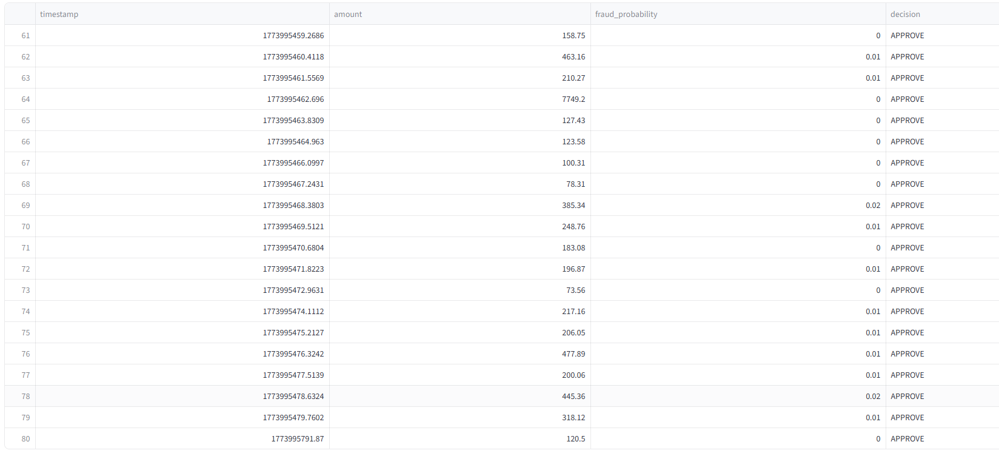
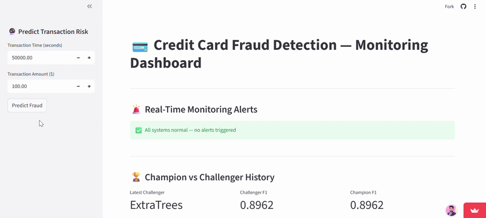

# 💳 Credit Card Fraud Detection — ML System

[](https://github.com/narendrakalam2001/fraud-detection-ml-system/actions)
[](https://python.org)
[](https://fastapi.tiangolo.com)
[](https://streamlit.io)
[](#-champion-model-results)
[](https://docker.com)
[](https://mlflow.org)
[](#-test-coverage)

> **Domain:** BFSI / Fintech · Payments
> **Problem:** Binary Classification — Real-Time Credit Card Fraud Detection (578:1 class imbalance)
> **Dataset:** [Kaggle Credit Card Fraud Detection — 284,807 transactions · 492 frauds](https://www.kaggle.com/datasets/mlg-ulb/creditcardfraud)
> **Industry Context:** Simulates a real-time payment-gateway fraud pipeline — 4-tier APPROVE / REVIEW / BLOCK decision engine with hard rules + ML score

---

## 💡 Why This Project Matters

Real fraud detection needs more than a trained classifier scoring a transaction in isolation.
This system combines ML + business rules + monitoring + governance to simulate a real
payment-system decision pipeline:

- An **ExtraTrees classifier** (selected from 12 tuned models) scores every transaction for
  fraud probability, trained on temporal, graph-based, and anomaly-score engineered features
- A **4-tier Rule Engine** applies hard rules **before** the ML score — an amount over $5,000
  is blocked outright, regardless of what the model says, mirroring how real payment gateways
  short-circuit obviously risky transactions
- Every model promotion goes through a **3-gate Champion vs Challenger** check — no model
  reaches production without demonstrably better F1 and generalization than the current champion
- **SMOTE + fast training sampling** handle the extreme 578:1 fraud-to-legitimate class imbalance
- **Edge-based PSI drift monitoring** (fixed from an earlier rank-based bug) tracks feature drift
  correctly over time

This mirrors real card-network fraud pipelines, where a missed fraud (false negative) and an
unnecessary block on a legitimate customer (false positive) both carry a real dollar cost.

---

## 🏆 Champion Model Results

| Metric | Score |
|---|---|
| **Champion Model** | `ExtraTrees` |
| **F1 Score** | `0.8962` |
| **ROC-AUC** | `0.9669` |
| **PR-AUC** | `0.8817` |
| **KS Statistic** | `0.9090` |
| **Precision** | `0.9318` |
| **Recall** | `0.8632` |
| **Brier Score** | `0.0003` |
| **Train-Test Gap** | `0.0004` |
| **Decision Threshold** | `0.2100` |
| **Estimated Fraud Loss** | `$834.69` |

> *Exact values depend on training run — see `fraud_models/model_card_ExtraTrees_v1.json`*

---

## 🔗 Live Links

| Service | URL |
|---|---|
| 🚀 **API Docs (Swagger UI)** | [fraud-detection-ml-system.onrender.com/docs](https://fraud-detection-ml-system.onrender.com/docs) |
| 📊 **Monitoring Dashboard** | [fraud-detection-ml-system.streamlit.app](https://fraud-detection-ml-system.streamlit.app) |
| 📓 **EDA Notebook** | [notebooks/fraud_detection_eda.ipynb](notebooks/fraud_detection_eda.ipynb) |

> ⚠️ Render free tier: first request may take 30–60 seconds (cold start).

---

## 🏗️ System Architecture


```
╔══════════════════════════════════════════════════════════════════════════════════╗
║           CREDIT CARD FRAUD DETECTION — 5-LAYER PRODUCTION SYSTEM                ║
╠══════════════════════════════════════════════════════════════════════════════════╣
║                                                                                  ║
║  ┌─────────────────────────────── DATA LAYER ──────────────────────────────┐     ║
║  │  Transaction CSV  →  Validate  →  Leakage Check  →  Feature Engineering │     ║
║  │  284,807 transactions · 492 frauds (578:1 imbalance) · temporal+graph   │     ║
║  └───────────────────────────────────┬─────────────────────────────────────┘     ║
║                                      ▼                                           ║
║  ┌─────────────────────────── TRAINING PIPELINE ───────────────────────────┐     ║
║  │                                                                         │     ║
║  │  ┌──────────────────┐    ┌───────────────┐    ┌──────────────────────┐  │     ║
║  │  │  IQR Clipper +   │    │  12 Models    │    │  Evaluation          │  │     ║
║  │  │  Dual Column     │───▶│  Tuned via    │───▶│  F1 · ROC-AUC · KS  │  │     ║
║  │  │  Transformer +   │    │  RandomSearch │    │  PR-AUC · Brier      │  │     ║
║  │  │  SMOTE + sample  │    │  (PR-AUC opt) │    │  Recall@K · Lift@K   │  │     ║
║  │  └──────────────────┘    └───────────────┘    └──────────────────────┘  │     ║
║  │                                                                         │     ║
║  │  LR · SGD · GaussianNB · DecisionTree · RandomForest · ExtraTrees ⭐    │     ║
║  │  GradientBoosting · AdaBoost · XGBoost · LightGBM · CatBoost · MLP      │     ║
║  │                                                                         │     ║
║  │  CHAMPION → ExtraTrees  F1=0.8962  ROC-AUC=0.9669  PR-AUC=0.8817        │     ║
║  └───────────────────────────────────┬─────────────────────────────────────┘     ║
║                                      ▼                                           ║
║  ┌──────────────────────── CHAMPION-CHALLENGER ────────────────────────────┐     ║
║  │                                                                         │     ║
║  │  Gate 1: F1 improvement   ≥ 0.5%   →  ✅ PASS / ❌ FAIL                │     ║
║  │  Gate 2: ROC-AUC          ≥ 0.95   →  ✅ PASS / ❌ FAIL                │     ║
║  │  Gate 3: Train-test gap   ≤ 10%    →  ✅ PASS / ❌ FAIL                │     ║
║  │                                                                         │     ║
║  │  ALL gates pass → PROMOTED (latest_model.json updated)                  │     ║
║  │  ANY gate fails → REJECTED (champion retained, result logged)           │     ║
║  └───────────────────────────────────┬─────────────────────────────────────┘     ║
║                                      ▼                                           ║
║  ┌──────────────────────────── SERVING LAYER ──────────────────────────────┐     ║
║  │                                                                         │     ║
║  │  Model Loader  →  Prediction Service  →  Rule Engine  →  FastAPI        │     ║
║  │                                                                         │     ║
║  │  POST /predict → single transaction scoring  (→ APPROVE/REVIEW/BLOCK)   │     ║
║  │  GET  /health  → API health check            (→ {status, model_loaded}) │     ║
║  │                                                                         │     ║
║  │  Rule Engine:  Hard Rule (Amount > $5,000) → ML Score → Threshold       │     ║
║  │                → BLOCK_RULE / BLOCK_MODEL / REVIEW / APPROVE            │     ║
║  └───────────────────────────────────┬─────────────────────────────────────┘     ║
║                                      ▼                                           ║
║  ┌─────────────────── MONITORING LAYER — STREAMLIT DASHBOARD ──────────────┐     ║
║  │                                                                         │     ║
║  │  Section 1: Real-Time Alerts     → fraud-score shift · decision-rate    │     ║
║  │  Section 2: Champion-Challenger  → decision · 3-gate status · history   │     ║
║  │  Section 3: KPIs + Charts        → F1 · ROC-AUC · PR-AUC · KS charts    │     ║
║  │  Section 4: PSI Drift            → edge-based, per-feature 🔴🟡🟢      │     ║
║  │  Section 5: Recent Predictions   → amount · fraud prob · decision       │     ║
║  │                                                                         │     ║
║  │  Simulator: 3 scenarios (safe · risky · random) → hits /predict API     │     ║
║  └─────────────────────────────────────────────────────────────────────────┘     ║
╚══════════════════════════════════════════════════════════════════════════════════╝
```

---

## 📸 Dashboard Screenshots

### 🖥️ Full Dashboard UI

Real-time transaction fraud scoring + Champion vs Challenger history.



---

### 📈 Fraud Score and Decision Distribution

Fraud probability distribution across transactions, with APPROVE / REVIEW / BLOCK decision breakdown.



---

### 📊 Score Statistics

Statistical summary of fraud scores and labels to monitor distribution shifts over time.


---

### 📉 Feature Drift Report (PSI)

Edge-based PSI drift monitoring with 🔴🟡🟢 status flags per feature.




---

### 🔍 Recent Predictions

Recent transactions with amount, fraud probability, and decision.



---

## 📊 Training Reports

| Model Results | Test Coverage |
|---|---|
|  |  |

---

## 🎬 System Demo



---

## 📁 Project Structure

```
fraud-detection-ml-system/
│
├── src/                                # Core ML system
│   ├── config.py                       # Constants, thresholds, PSI limits, challenger gates
│   ├── data_loader.py                  # Validation + feature engineering
│   ├── preprocessing.py                # Clipper (IQR) + dual ColumnTransformer
│   ├── model_tuning.py                 # 12 model grids + RandomizedSearchCV (PR-AUC scoring)
│   ├── metrics.py                      # PSI (edge-based fix), KS, cost eval, threshold tuning
│   ├── rule_engine.py                  # 4-tier decision engine
│   ├── evaluation.py                   # Model card, feature importances, MLflow, PSI drift
│   ├── leakage_check.py                # Pre-training leakage detection
│   ├── model_loader.py                 # Champion load + 3-gate challenger comparison
│   ├── anomaly_detection.py            # IsolationForest anomaly score
│   ├── neural_net.py                   # MLP pipeline
│   ├── sampling.py                     # fast_training_sample
│   └── training_pipeline.py            # Full orchestration
│
├── serving/
│   └── fraud_api.py                    # FastAPI: /predict · /health
│
├── services/
│   └── prediction_service.py           # Feature prep + inference wrapper
│
├── monitoring/
│   └── monitoring_dashboard.py         # Streamlit: 5-section monitoring dashboard
│
├── simulation/
│   └── transaction_simulator.py        # 3-scenario transaction generator
│
├── feature_store/
│   └── fraud_features.py               # Feature store — temporal + engineered features
│
├── graph_detection/
│   └── fraud_graph_detection.py        # Graph-based fraud signal
│
├── scripts/
│   ├── train_model.py                  # Entry point: python scripts/train_model.py
│   ├── run_api.py                      # python scripts/run_api.py
│   ├── run_dashboard.py                # streamlit run monitoring/monitoring_dashboard.py
│   └── run_simulation.py               # python scripts/run_simulation.py
│
├── tests/
│   └── test_pipeline_core.py           # 35 pytest unit tests
│
├── notebooks/
│   ├── fraud_detection_eda.ipynb       # Professional EDA — 25 steps
│   └── fraud_detection_eda.html        # Rendered HTML version
│
├── data/
│   └── sample_transactions.csv       # A representative balanced sample dataset is provided in quick testing
│
├── fraud_models/                       # Model artifacts — all files pushed to GitHub
│   ├── latest_model.json               # Champion model registry
│   ├── challenger_log.json             # Full Champion-Challenger comparison history
│   ├── model_card_ExtraTrees_v1.json   # Structured model card
│   ├── fraud_model_v1_metadata.json    # Model metadata
│   ├── model_experiment_results.csv    # All 12 models comparison table
│   ├── monitor_scores.csv              # Prediction confidence scores log
│   ├── feature_drift_report.csv        # PSI drift per feature
│   └── fraud_model_ExtraTrees_v1.joblib # Trained champion model
│
├── docs/
│   ├── architecture/
│   │   └── system_architecture.svg     # 5-layer system architecture diagram
│   ├── screenshots/
│   │   ├── dashboard_full_ui.png
│   │   ├── fraud_score_decision_distribution.png
│   │   ├── score_statistics.png
│   │   ├── drift_report.png
│   │   ├── drift_score.png
│   │   ├── recent_prediction.png
│   │   └── api_demo.png
│   ├── reports/
│   │   ├── model_results.png           # All 12 models comparison
│   │   └── test_coverage.png           # pytest coverage report
│   └── gifs/
│       └── system_demo.gif             # End-to-end system demo
│
├── logs/
│   └── prediction_logs.csv             # API prediction audit log (auto-generated)
│
├── .streamlit/
│   └── config.toml
│
├── Dockerfile                          # API Docker image
├── Dockerfile.dashboard                # Streamlit dashboard container
├── docker-compose.yml                  # API + Dashboard together
├── .dockerignore
├── .github/workflows/ci.yml            # GitHub Actions — pytest on every push
├── .gitignore
├── LICENSE                             # MIT License
├── README.md                           # This file
├── render.yaml                         # Render.com deployment config
├── requirements.txt                    # Full training requirements
├── requirements_api.txt                # Lean API-only requirements
├── requirements_dashboard.txt          # Dashboard-only requirements
└── runtime.txt                         # Python version for Render
```

---

## 🚀 Quickstart

### 1. Clone & Install

```bash
git clone https://github.com/narendrakalam2001/fraud-detection-ml-system.git
cd fraud-detection-ml-system
pip install -r requirements.txt
```

### 2. Download Dataset

Download [Kaggle Credit Card Fraud Dataset](https://www.kaggle.com/datasets/mlg-ulb/creditcardfraud) → place `creditcard.csv` anywhere accessible.

```bash
# Windows PowerShell
$env:FRAUD_DATA_PATH = "path\to\creditcard.csv"

# Mac / Linux
export FRAUD_DATA_PATH=path/to/creditcard.csv

data/
└── sample_transactions.csv

 A representative balanced sample dataset is provided in quick testing
```

> Note: the sample dataset in `data/` is a subset of the original raw dataset — all preprocessing
> and feature engineering are handled in the pipeline.

### 3. Train Model

```bash
python scripts/train_model.py
```

Expected output:
```
INFO  Data validation passed | 284,807 transactions | 492 frauds (578:1 imbalance)
INFO  Tuning 12 models ... [LR · SGD · GaussianNB · DecisionTree · RF · ExtraTrees ...]
INFO  === SELECTED MODEL: ExtraTrees  (f1=0.8962) ===
INFO  Best threshold: 0.2100  |  precision=0.9318  recall=0.8632
INFO  Champion-Challenger: PROMOTED
INFO  TRAINING COMPLETE — F1=0.8962 · ROC-AUC=0.9669 · PR-AUC=0.8817
```

### 4. Start API

```bash
python scripts/run_api.py
# → http://localhost:8000/docs
```

### 5. Start Monitoring Dashboard

```bash
streamlit run monitoring/monitoring_dashboard.py
# → http://localhost:8501
```

### 6. Run Transaction Simulator

```bash
python scripts/run_simulation.py --scenario safe  --n 20
python scripts/run_simulation.py --scenario risky --n 20
python scripts/run_simulation.py --scenario random --n 30
```

### 7. Run Tests

```bash
pytest tests/ -v --cov=src --cov-report=term-missing
# 35 pytest unit tests
```

---

## 🐳 Docker

```bash
# API only
docker build -t fraud-detection-api .
docker run -p 8000:8000 -v ./fraud_models:/app/fraud_models fraud-detection-api

# API + Dashboard together
docker compose up --build
```

| Service | URL |
|---|---|
| FastAPI | `http://localhost:8000` |
| Streamlit Dashboard | `http://localhost:8501` |

---

## 🔌 API Reference

### POST /predict — Single Transaction Scoring

```bash
curl -X POST "http://localhost:8000/predict" \
  -H "Content-Type: application/json" \
  -d '{
    "Time": 50000,
    "Amount": 120.5
  }'
```

**Response:**
```json
{
  "fraud_probability": 0.0312,
  "decision": "APPROVE",
  "rule_triggered": null,
  "latency_seconds": 0.043
}
```

### GET /health

```json
{"status": "running", "model_loaded": true}
```

---

## 🧠 Technical Standards

| Component | Implementation |
|---|---|
| **Class Imbalance** | SMOTE + `fast_training_sample` — handles 578:1 fraud-to-legit ratio |
| **Outlier Clipping** | Custom IQR-based `Clipper` — prevents outlier distortion of `StandardScaler` |
| **Dual Preprocessors** | `preprocessor_scaled` (linear models) + `preprocessor_unscaled` (tree models) |
| **Feature Engineering** | Temporal (sin/cos), feature store, graph-based signal, `IsolationForest` anomaly score |
| **Models Tuned** | LR · SGD · GaussianNB · DecisionTree · RandomForest · **ExtraTrees** · GradientBoosting · AdaBoost · XGBoost · LightGBM · CatBoost · MLP |
| **Hyperparameter Tuning** | `RandomizedSearchCV` — PR-AUC scoring |
| **Champion-Challenger** | 3-gate: F1 improvement ≥ 0.5% · ROC-AUC ≥ 0.95 · Train-test gap ≤ 10% |
| **PSI Drift Monitoring** | Edge-based — corrected from an earlier rank-based implementation bug |
| **Experiment Tracking** | MLflow — metrics · params · model artifact per run |
| **Model Card** | Structured JSON — metrics, cost eval, feature importances |
| **Leakage Detection** | Exact match + near-perfect correlation check before training |
| **Rule Engine** | Hard rule (Amount > $5,000) + ML threshold → BLOCK_RULE / BLOCK_MODEL / REVIEW / APPROVE |
| **CI/CD** | GitHub Actions — pytest on every push |
| **Deployment** | Render.com (FastAPI) + Streamlit Cloud (Dashboard) |

---

## 📊 Model Comparison — Actual Training Run

| Model | Test F1 | Precision | Recall | ROC-AUC | PR-AUC | KS | Brier | Gen. Gap | Threshold |
|---|---|---|---|---|---|---|---|---|---|
| **ExtraTrees** ⭐ | **0.8962** | 0.9318 | 0.8632 | 0.9669 | **0.8817** | 0.9090 | **0.0003** | 0.0004 | 0.2100 |
| RandomForest | 0.8840 | 0.9302 | 0.8421 | 0.9672 | 0.8711 | 0.9198 | 0.0004 | 0.0004 | 0.3400 |
| SGD | 0.8495 | 0.8681 | 0.8316 | 0.9865 | 0.7993 | 0.8947 | 0.0008 | 0.0001 | 0.0000 |
| NeuralNet (MLP) | 0.8541 | 0.8778 | 0.8316 | 0.9774 | 0.8208 | 0.8987 | 0.0005 | 0.0001 | 0.3204 |
| LogisticRegression | 0.8525 | 0.8864 | 0.8211 | **0.9857** | 0.8352 | 0.9092 | 0.0004 | 0.0001 | 0.5295 |
| GaussianNB | 0.8342 | 0.8478 | 0.8211 | 0.9796 | 0.7368 | 0.8861 | 0.0021 | 0.0001 | 1.0000 |
| DecisionTree | 0.7629 | 0.7475 | 0.7789 | 0.8893 | 0.5826 | 0.7785 | 0.0008 | 0.0008 | 1.0000 |

> Selection rule: highest test F1 among tuned candidates → **ExtraTrees** selected (`f1=0.8962`,
> `precision=0.9318`, `recall=0.8632`, `threshold=0.2100`). GradientBoosting, AdaBoost, XGBoost,
> LightGBM, and CatBoost were also tuned as part of the full 12-model sweep — see
> `fraud_models/model_experiment_results.csv` for the complete comparison.

---

## 💰 Cost Evaluation

Cost-sensitive evaluation on the actual test run:

| Event | Count / Cost |
|---|---|
| False Negatives (missed fraud) | `13` |
| False Positives (wrongly flagged) | `6` |
| Estimated Fraud Loss | `$834.69` |
| Review Cost | `$30.00` |
| **Total Estimated Loss** | **`$864.69`** |

---

## 🎯 Rule Engine — 4-Tier Decision System

Unlike simple binary classifiers, this system uses a **4-tier decision engine** that checks
hard rules **before** the ML score — matching real payment-system architecture:

| Decision | Trigger |
|---|---|
| `BLOCK_RULE` | Hard rule — Amount > $5,000, overrides ML score |
| `BLOCK_MODEL` | High fraud probability (prob ≥ threshold) |
| `REVIEW` | Borderline score (prob ≥ threshold × 0.6) |
| `APPROVE` | Low probability + no rule flags |

**Real run — Rule Engine decision counts** (test set):

| Decision | Count |
|---|---|
| `APPROVE` | `56,639` |
| `BLOCK_MODEL` | `88` |
| `BLOCK_RULE` | `12` |
| `REVIEW` | `7` |

Results logged to `fraud_models/challenger_log.json` and visible in the dashboard Section 2 with per-gate ✅/❌ status.

---

## 📈 Monitoring Dashboard — 5 Sections

| Section | What it shows |
|---|---|
| **1. Real-Time Alerts** | Fraud-score distribution shift · abnormal approval/block rates |
| **2. Champion-Challenger** | Latest decision badge · 3-gate pass/fail status · full history |
| **3. KPIs + Charts** | F1 · ROC-AUC · PR-AUC · KS · model comparison charts |
| **4. PSI Drift** | Edge-based per-feature PSI with 🔴🟡🟢 status flags |
| **5. Recent Predictions** | Amount · fraud probability · decision per transaction |

---

## 🧪 Test Coverage — 35 Passing


35 pytest unit tests covering:

`Clipper` · `build_preprocessors` · `detect_leakage` · `tune_threshold` · `psi` ·
`recall_at_k` · `lift_at_k` · `ks_statistic` · `rule_engine` · `config` thresholds

```bash
pytest tests/ -v --cov=src --cov-report=term-missing
```

---

## 🛡️ Ethical Considerations

- Model outputs must be reviewed by qualified fraud/risk analysts before final BLOCK decisions
- Regular fairness and drift audits recommended — spending-pattern proxies can encode bias against certain customer segments
- Not designed for: fully automated blocking without human review on `REVIEW`-tier transactions
- The dataset is heavily anonymized (PCA-transformed features) and highly imbalanced (578:1) —
  re-validate thresholds and cost assumptions before use on a live production feed
- Hard rules (e.g. Amount > $5,000) should be tuned to the deploying institution's actual risk appetite

---

## 📌 Future Improvements

- Kafka streaming for real-time transaction ingestion
- Online learning with concept-drift adaptation
- SHAP explainability (version compatibility fix pending)
- A/B traffic splitting for live champion/challenger testing

---

## 👨‍💻 About

**Narendra Kalam** — MSc Computer Science (Gold Medalist — NASSCOM, Full Stack Data Science + AI)

> Building 20+ industry-level, end-to-end ML systems targeting **30+ LPA** at top MNCs in India.

[](https://www.linkedin.com/in/narendra-kalam/)
[](https://www.kaggle.com/narendrakalam)
[](https://narendrakalam2001.github.io/)
[](mailto:kalamnarendra2001@gmail.com)

### Portfolio Projects

| # | Project | Domain | Champion Model | Key Metric |
|---|---|---|---|---|
| 1 | **Credit Card Fraud Detection** | **BFSI / Fintech** | **ExtraTrees** | **F1 = 0.8962 · 284K transactions** |
| 2 | Credit Risk Prediction | BFSI / Lending | LightGBM | F1 = 0.9741 · ROC-AUC = 0.9991 |
| 3 | Customer Churn Prediction | Telecom / BFSI | CatBoost | F1 = 0.634 · Recall = 0.7312 |
| 4 | House Price Prediction | Real Estate | CatBoost | RMSE = $20,128 · R² = 0.9053 |
| 5 | Store Sales Forecasting | Retail / Supply Chain | LightGBM (Ensemble) | RMSLE = 0.3739 · R² = 0.9761 |
| 6 | Energy Demand Forecasting | Energy / Utilities | ElasticNet | RMSE = 712.04 MW · R² = 0.9759 |
| 7 | Stock Price & Risk Forecasting | Fintech / Capital Markets | Ridge | DirAcc = 53.44% · Sharpe = 0.80 |
| 8 | Resume Screener AI | HR Tech | LightGBM | F1 = 0.7608 · Top-3 = 0.9416 |
| 9 | ABSA Sentiment Analysis | E-Commerce / Banking | RidgeClassifier | Macro-F1 = 0.6212 · ROC-AUC = 0.823 |
| 10 | Fake News Detector | Media Tech / Gov Tech | XGBoost | F1 = 0.9993 · ROC = 1.0000 |
| 11 | BC5CDR Clinical NER | Biomedical NLP | BioBERT | F1 = 0.8847 · Chemical F1 = 0.9239 |
| 12 | News Topic Modeling | Media Analytics | LDA (Gensim) | Cv = 0.6225 · Diversity = 0.92 |
| 13 | Chest X-Ray Diagnosis | Healthcare AI | DenseNet121 | Mean AUC = 0.7864 · 14 classes |

---

## 📄 License

MIT License — see [LICENSE](LICENSE)